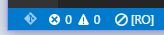
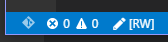
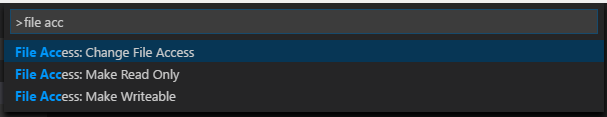

# Functionality

Adds a status bar indicating if a file is read-only or writeable.

# Installation

Press `F1` in VSCode, type `ext install` and then look for `Status Bar Read-Only Indicator`.

# Usage

You don't need to do anthing. It automatically adds itself in the status bar.

### Read-only



### Writeable



## Available commands

* **File Access: Change File Access** Choose the new File Access
* **File Access: Make Read-only** Make the file Read-Only
* **File Access: Make Writeable** Make the file Writeable



## Available settings

* Defines the position where the Status Bar indicator is located
    ```json
    "fileAccess.position": "left" // or "right"
    ```

* Define how much information is displayed in the Status Bar indicator
    ```json
    "fileAccess.uiMode": "complete" // or "simple"
    ```

## Support

While **Status Bar Read-only Indicator** is free and open source, if you find it useful, please consider supporting it.

I've been working on this on my spare time, and although I enjoy developing it, I would like to be able to give more attention to its growth.

<table align="center" width="60%" border="0">
  <tr>
    <td>
      <a title="Paypal" href="https://www.paypal.com/cgi-bin/webscr?cmd=_donations&business=EP57F3B6FXKTU&lc=US&item_name=Alessandro%20Fragnani&item_number=vscode%20extensions&currency_code=USD&bn=PP%2dDonationsBF%3abtn_donate_SM%2egif%3aNonHosted"></a>
    </td>
    <td>
      <a title="Paypal" href="https://www.paypal.com/cgi-bin/webscr?cmd=_donations&business=EP57F3B6FXKTU&lc=BR&item_name=Alessandro%20Fragnani&item_number=vscode%20extensions&currency_code=BRL&bn=PP%2dDonationsBF%3abtn_donate_SM%2egif%3aNonHosted"></a>
    </td>
    <td>
      <a title="Patreon" href="https://www.patreon.com/alefragnani"></a>
    </td>
  </tr>
</table>

---

# License

[MIT](LICENSE.md) &copy; Alessandro Fragnani